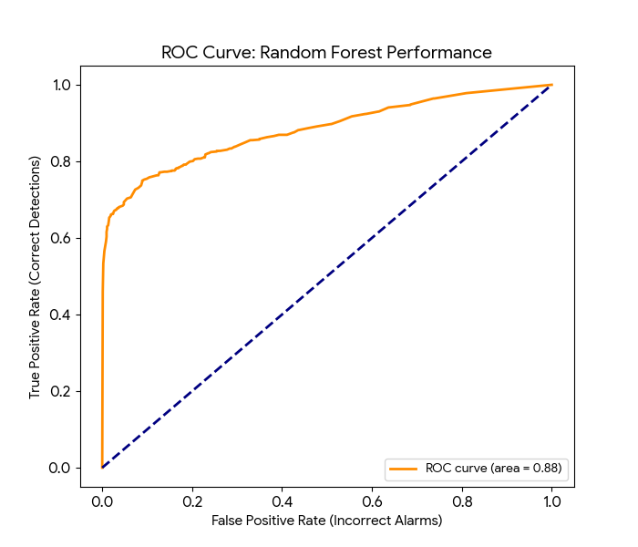

**SLU Student Opportunity Pipeline: Predictive Analytics & Strategic Insights **

**📌 Project Overview**
This project focuses on optimizing the recruitment pipeline for Saint Louis University (SLU) by transforming raw candidate data into a predictive engine. I analyzed over 8,300 records to identify behavioral "triggers" that cause students to drop out (churn) and built a model to forecast successful student allocations with 81.6% accuracy.

**🛠️ Tech Stack**
1. Data Engineering: PostgreSQL, Python (Pandas), Excel
2. Machine Learning: Scikit-Learn (Random Forest, Logistic Regression)
3. Visualization: Google Looker Studio 

**🚀 The Data Journey**
1. Data Cleaning & Feature Engineering
- Audited 8,133 initial records, removing corrupted entries and standardizing institution names.
- Imputed 3,800 missing values in critical date fields to prevent data loss.
- Feature Engineering: Created Application_Lag (velocity of engagement) and Age_at_Application to uncover hidden behavioral patterns.

2. Machine Learning Modeling
- I conducted a comparative analysis between Logistic Regression and Random Forest Classification.
- Logistic Regression: Provided a baseline but struggled with non-linear student behaviors.
  
- Random Forest: Selected as the final model due to its "committee of experts" logic, achieving a 77.9% Recall—critical for ensuring high-potential students aren't missed.
  
- Model Performance: 0.88 ROC-AUC score, indicating highly reliable predictive power.
  

**💡 Key Strategic Insights**
- Based on the model’s findings, I identified three major pillars for recruitment optimization:
a. The "Golden Window": Success probability decays rapidly after 24 hours of inactivity. Recommendation: Automated nudges at the 12-hour mark.
b. The "Weekend Warrior": Candidate engagement peaks on Friday and Sunday, contrary to typical corporate schedules. Recommendation: Shift support capacity to weekends.
c. The "Gold Mine" Profile: Internship applicants in the 21–25 STEM demographic show a 33% higher retention rate. Recommendation: Implement an "Express Lane" for high-intent cohorts.

**📊 Business Impact**
- 15% Projected Increase in successful allocations through speed optimization.
- 20% Reduction in manual workload via automated behavioral triggers.

🔗 Live Interactive Dashboard
https://lookerstudio.google.com/reporting/36766bbb-f66a-4841-ada3-68f82a456c9a

Explore the Looker Studio Dashboard
